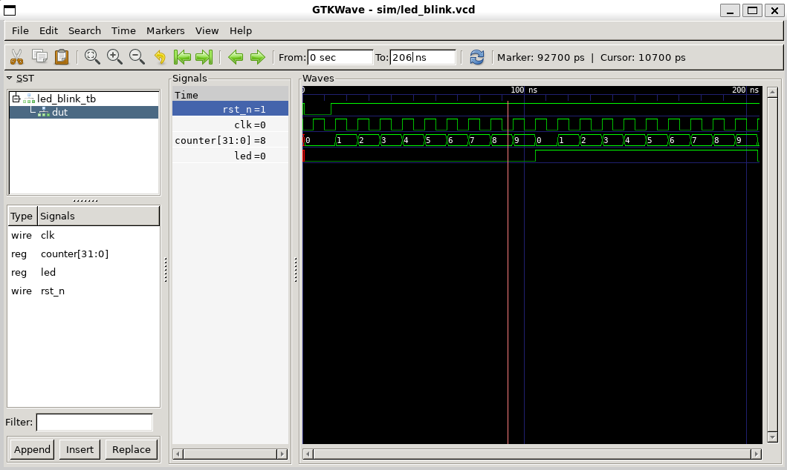

# Chapter 01 - LED Blink

## Overview

A counter toggles an LED at a fixed interval. This is the first FPGA design.

Topics: Verilog module, ports, counter, sequential logic, testbench, waveform verification.

---

## Directory Structure

```text
01-led/
├─ rtl/
│  └─ led_blink.v
├─ tb/
│  └─ led_blink_tb.v
├─ sim/
│  ├─ led_blink_tb
│  └─ led_blink.vcd
├─ images/
│  └─ led_blink_waveform.png
└─ README.md
```

---

## Design

| Signal | Dir | Description |
|--------|-----|-------------|
| `clk` | in | Clock |
| `rst_n` | in | Active-low reset |
| `led` | out | LED output |

```text
          +-------------+
 clk ---->|             |
 rst_n -->|   Counter   |
          |             |
          +------+------+
                 |
                 v
          +-------------+
          | LED Control |
          +------+------+
                 |
                 v
                led
```

### Behavior

```verilog
parameter TARGET_COUNT = 9;
```

The counter increments on every clock edge. When `counter == TARGET_COUNT`:

```text
counter = 0
led = ~led
```

The testbench uses a 100 MHz clock:

```verilog
always #5 clk = ~clk;
```

```text
Clock period = 10 ns
Counts per toggle = 10 (0 → 9)
Toggle interval = 10 × 10 ns = 100 ns
```

Expected timing:

```text
13 ns   Reset released
105 ns  LED = 1
205 ns  LED = 0
305 ns  LED = 1
...
```

On real hardware, calculate `TARGET_COUNT` from the board clock frequency and the blink interval.

---

## Simulation

Run from the `01-led/` directory.

```bash
iverilog -o sim/led_blink_tb rtl/led_blink.v tb/led_blink_tb.v   # compile
vvp sim/led_blink_tb                                             # run
gtkwave sim/led_blink.vcd                                        # view waveform
```

Expected output:

```text
VCD info: dumpfile sim/led_blink.vcd opened for output.
PASS: LED blink behavior is correct
```

GTKWave signals (hierarchy: `led_blink_tb` → `dut`):

```text
clk
rst_n
dut.counter
dut.led
```

---

## Waveform



- `rst_n` is active low; released at 13 ns
- `counter` counts 0 to 9
- `led` toggles every 100 ns; first toggle at 105 ns

---

## Verification Checklist

- [ ] LED is OFF during reset
- [ ] Counter increments correctly
- [ ] LED toggles at `TARGET_COUNT`
- [ ] LED keeps blinking periodically
- [ ] Simulation reports PASS

---

## Next Chapter

### Chapter 02 - Key Input

Chapter 01 drives an output from a clock. Chapter 02 adds an external input.

```text
Chapter 01:  Clock -> LED
Chapter 02:  Key   -> LED

Press Key   -> LED ON
Release Key -> LED OFF
```

Topics: input handling, FPGA GPIO basics, active-low signals, combinational logic, testbench stimulus.